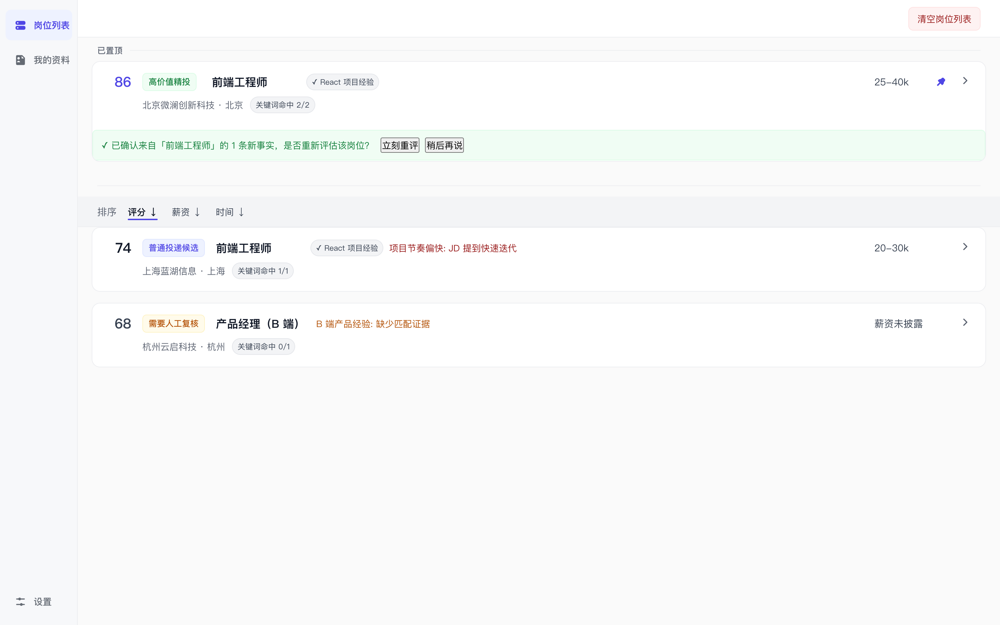
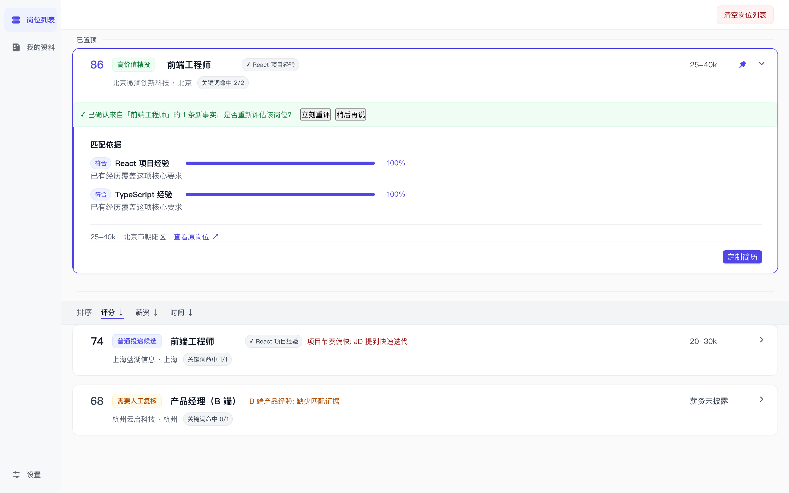
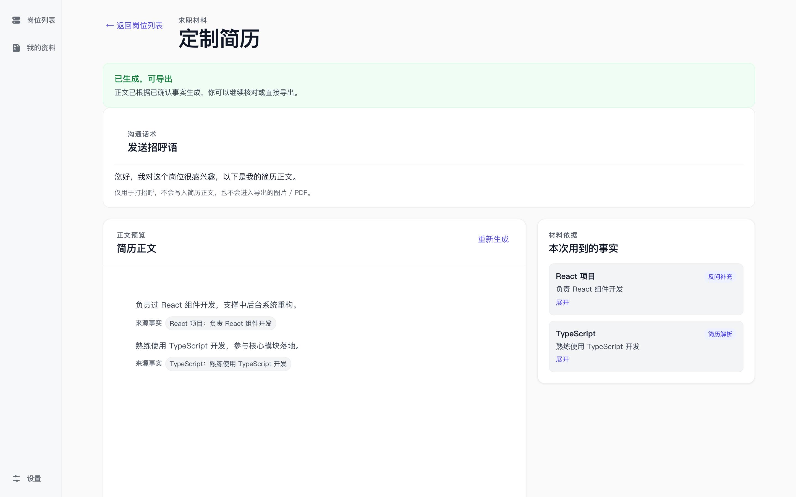
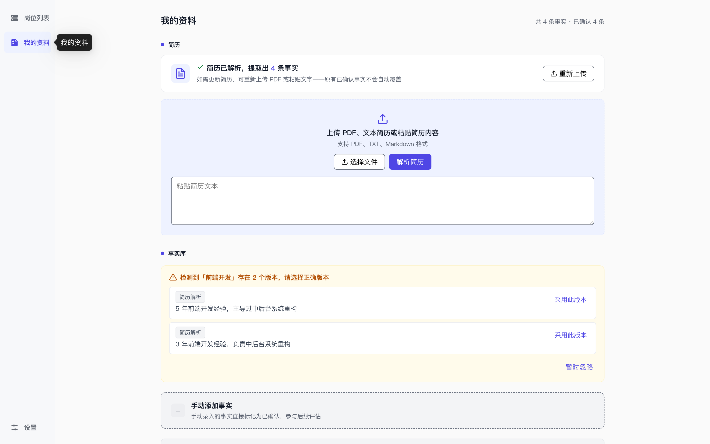

# BOSS Local Job Radar

本地优先的 BOSS 直聘岗位雷达：浏览器插件只读采集岗位 JD，本地 Electron 应用完成简历解析、岗位评分、偏好否决、追问补全与定制材料生成。

> **非官方声明：** 本项目是个人独立开发的非官方工具，与 BOSS 直聘及其关联公司不存在隶属、授权或背书关系。使用者应自行遵守相关平台规则与适用法律。

## 界面预览









## 组成

- `src/`：React 渲染层 + 领域逻辑（`src/domain/`）
- `electron/`：Electron 主进程、preload、简历图片渲染
- `browser-extension/`：基于 WXT 的 BOSS 岗位只读采集插件
- `scripts/`：验证脚本与评测脚本

## 核心链路


1. 插件从 BOSS 页面读取当前岗位标题、公司、JD、地址、来源链接、薪资原文与城市；薪资无法解析时显示「薪资未披露」，不参与薪资排序和偏好加分。
2. 插件只通过 `127.0.0.1:8765-8767` 把数据 POST 到本地应用。
3. 本地应用抽取 JD 要求与风险，用已确认事实库进行 LLM 语义匹配评分。
4. 硬否决、软偏好与风险惩罚在本地确定性计算。
5. 根据评分生成追问，确认后生成可溯源简历材料，并导出文本/图片/PDF。

## 开发与验证

需要 Node.js 22+。首次安装时，浏览器插件的 `postinstall` 会自动执行 `wxt prepare` 生成类型文件。

```bash
npm ci
npm --prefix browser-extension ci

npm run dev
npm test
npm run build
npm run verify:electron
npm run verify:browser-extension
npm run verify:release
```

## 当前状态

本项目当前为**源码开放阶段**，还不是面向普通用户的成品发布版。主要可用能力已经可运行，但仍缺少打包安装器、自动更新、商店签名和完整 E2E 测试。

## 开源与贡献

本项目使用 MIT License。贡献前请阅读：

- `CONTRIBUTING.md`
- `CODE_OF_CONDUCT.md`
- `SECURITY.md`
- `.github/pull_request_template.md`

请不要提交真实 API Key、本地配对 token、简历原文或岗位采集日志。

## 安全边界

- 数据默认只保存在本机；岗位采集只读，不点击、不提交、不导航。
- BYOK API Key 经 Electron `safeStorage` 加密后独立落盘，绝不写入 `CoreState`，也不参与广播。
- 本地 HTTP 服务只绑定 `127.0.0.1`，校验 Host、Origin、回环地址和配对 token 四道防线。
- 渲染层只通过 preload 暴露的最小 API 与主进程通信，不暴露 `ipcRenderer` 或文件路径。

详见 `SECURITY.md`。
