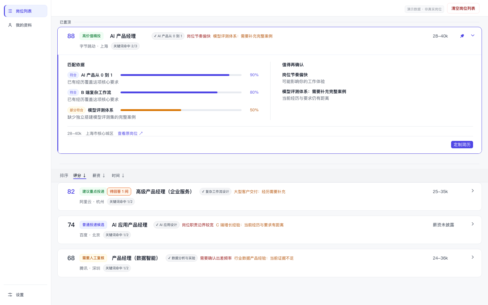
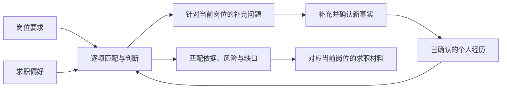
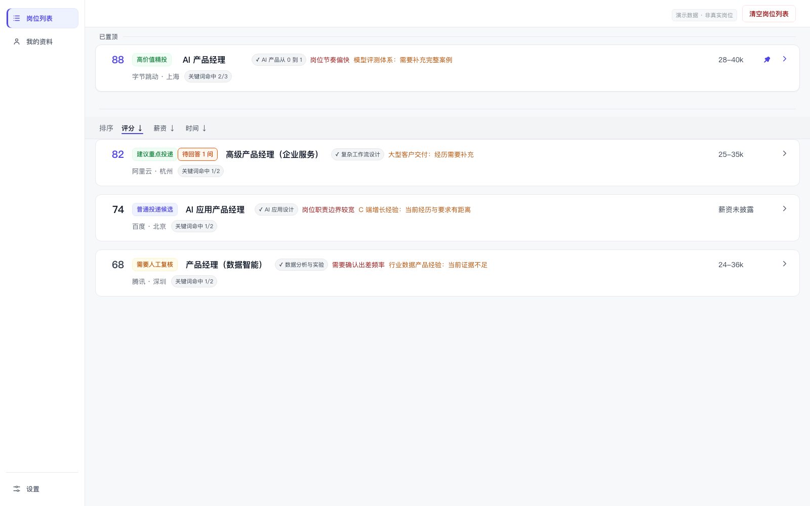
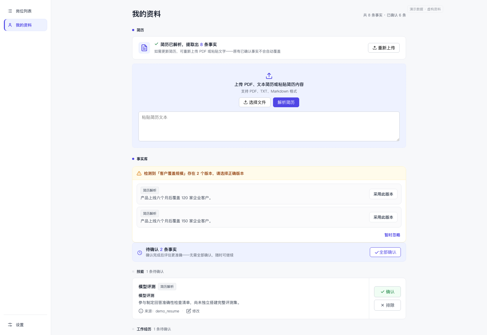
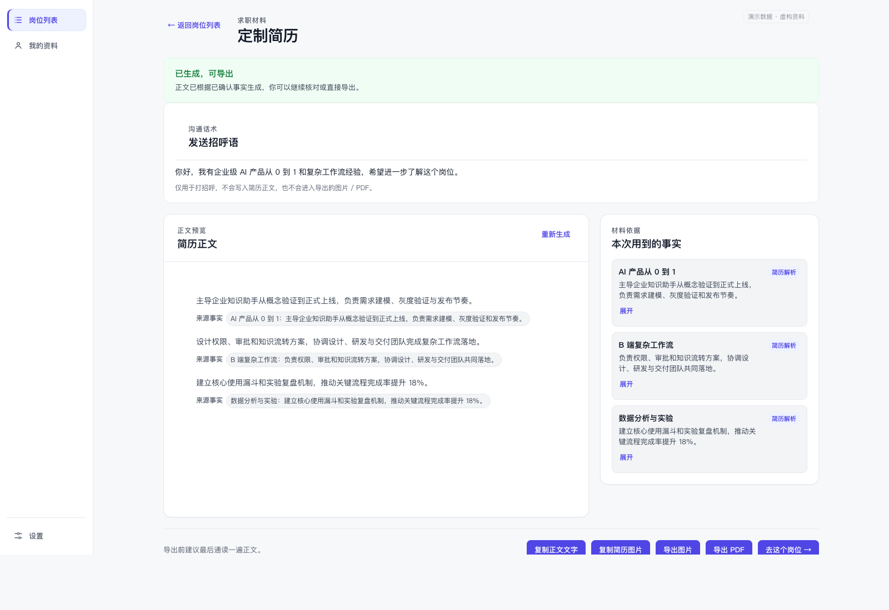

# JobGauge

JobGauge 使用 AI 理解岗位要求，并把它与个人经历、求职偏好和风险条件放在一起，为每个岗位形成对应的匹配判断、补充问题和求职材料。

AI 不只用于最后生成一段简历文字。从简历事实提取、岗位分析、经历匹配，到信息补充和材料生成，它参与整条流程，结果也会随着岗位和个人资料变化。



## 从岗位信息到求职判断

岗位描述说明公司需要什么，简历记录一个人做过什么，求职偏好则决定哪些机会值得继续投入。真正困难的是把这三部分放在一起，判断一个具体岗位是否值得继续，以及下一步需要补充什么、准备什么。

JobGauge 将岗位要求拆解为可以逐项核对的内容，再与已经确认的个人经历和求职偏好对应。得到的不只有一个分数，还有分数背后的匹配依据、经历缺口、岗位风险和建议动作。

## AI 如何参与整个流程

JobGauge 围绕 AI 原生构建岗位判断和材料准备流程。AI 不是附加在岗位列表后的文案生成功能，而是参与从理解用户到准备材料的每个关键环节。

- **理解个人经历**：从简历中提取工作经历、项目、技能和教育信息，整理成可以确认和修改的个人事实。
- **理解当前岗位**：识别岗位要求、能力重点、风险条件和可能影响判断的信息。
- **形成岗位判断**：理解岗位要求与个人经历之间的语义关系，展示匹配依据、经历缺口和仍需确认的问题。
- **继续追问**：当资料不足以判断某项要求时，围绕当前岗位缺少的信息生成补充问题，而不是使用一套固定问卷。
- **生成对应材料**：根据当前岗位和已经确认的事实生成简历正文与沟通话术，并展示正文所使用的事实来源。

同一份个人资料面对不同岗位，会得到不同的匹配依据、补充问题和求职材料；新事实被确认后，相关岗位也可以重新评估。



## 产品功能

### 整理和比较岗位

浏览器插件从当前岗位页面读取职位名称、公司、城市、薪资、工作地点和岗位描述，并将岗位导入桌面应用。JobGauge 分析岗位内容，在列表中展示评估结果、匹配项、风险、经历缺口和建议动作。

岗位可以按照评分、薪资或导入时间排序，也可以置顶需要继续跟进的机会。



### 查看匹配依据与待确认项

展开岗位后，可以逐项查看岗位要求与个人经历的对应情况。每项要求会展示当前匹配程度和说明；尚未确认的经历、岗位风险和能力缺口会单独列出。

补充资料后，JobGauge 可以重新评估岗位，并展示评估结果是否发生变化。

### 把简历整理成可确认的个人事实

JobGauge 从 PDF、TXT、Markdown 或粘贴的简历文本中提取工作经历、项目、技能、教育和偏好等事实。提取结果可以逐条确认、修改、排除，也可以手动补充。

当同一项经历出现多个版本时，资料页会列出冲突内容，由用户选择采用的版本。已处理事实默认收起，需要时可以重新展开和修改。



### 针对经历缺口继续追问

如果现有资料不足以判断某项岗位要求，JobGauge 会围绕该要求生成补充问题。回答经过确认后会加入个人事实库，并用于重新评估相关岗位。

这使岗位评估不是一次性的结果：随着资料逐渐完整，匹配依据和后续材料也会一起更新。

### 将求职偏好放进评估

用户可以用自然语言填写目标方向、目标城市、最低薪资和排除项。JobGauge 将这些内容整理成可以检查、删除和调整的规则，并在后续岗位评估中使用。

最低薪资和排除项作为明确规则参与评估，与 AI 生成的匹配分析分开处理。

### 生成有事实来源的求职材料

选择岗位后，JobGauge 根据该岗位的要求和已经确认的个人经历生成简历正文与一条沟通话术。正文会标出使用了哪些事实，便于在导出前核对内容是否准确。

生成结果可以复制为正文文字或简历图片，也可以导出为 PNG 和 PDF。



## 使用流程

1. 配置模型服务 API Key。
2. 上传简历并确认提取出的个人事实。
3. 填写目标方向、城市、薪资和排除项。
4. 安装浏览器插件并完成连接。
5. 在 BOSS 直聘打开岗位，通过插件导入。
6. 查看岗位评分、匹配依据、风险和待确认信息。
7. 根据需要补充经历并重新评估岗位。
8. 为选中的岗位生成和导出求职材料。

## 当前状态

JobGauge 仍在开发中，目前以源码形式提供，还没有安装包、自动更新和浏览器商店版本。

当前可运行的完整链路覆盖简历解析、事实确认、偏好设置、岗位导入与评估、补充问答、岗位重评，以及求职材料生成和导出。岗位导入目前适配 BOSS 直聘页面，模型相关功能目前使用通义千问兼容接口。

## 运行项目

### 环境要求

- Node.js 22 或更高版本
- npm
- Chrome 或其他 Chromium 浏览器

### 安装依赖

```bash
# 在仓库根目录
npm ci
npm --prefix browser-extension ci
```

### 启动桌面应用

直接构建并启动 Electron：

```bash
npm run electron:start
```

开发时分别启动 Vite 和 Electron：

```bash
# 终端 1
npm run dev

# 终端 2
npm run electron:dev
```

首次进入应用后，安装引导会依次完成模型 API Key、简历、求职偏好和浏览器插件配置。

### 构建浏览器插件

```bash
npm --prefix browser-extension run build
```

构建完成后，在浏览器扩展管理页开启开发者模式，选择“加载已解压的扩展程序”，并加载：

```text
browser-extension/.output/chrome-mv3
```

随后按照应用内的安装引导完成插件连接。

## 开发与验证

```bash
# 根项目测试
npm test

# 浏览器插件测试
npm --prefix browser-extension test

# TypeScript 检查与前端构建
npm run build

# 浏览器插件构建
npm --prefix browser-extension run build

# Electron、插件和公开文件检查
npm run verify:release
```

## 代码结构

```text
.
├── src/
│   ├── domain/              # 简历、事实、偏好、评分与材料生成逻辑
│   ├── job-list/            # 岗位列表组件与展示模型
│   └── *Page.tsx            # 桌面应用页面
├── electron/                # Electron 主进程与 preload
├── browser-extension/       # WXT 浏览器插件
├── scripts/                 # 验证与评测脚本
└── docs/                    # 使用说明与项目素材
```

主要技术包括 React、TypeScript、Electron、Vite、Vitest、Ant Design 和 WXT。

## 参与开发

提交修改前，请阅读 [CONTRIBUTING.md](CONTRIBUTING.md)。问题反馈和功能建议可以通过 GitHub Issues 提交；安全问题请按照 [SECURITY.md](SECURITY.md) 中的方式报告。

提交 Issue 或示例数据时，请勿附上真实 API Key、插件配对 token、简历原文或包含个人信息的岗位记录。

## License

[MIT](LICENSE)

## 声明

JobGauge 是个人独立开发的非官方项目，与 BOSS 直聘及其关联公司不存在隶属、授权或背书关系。使用者应自行遵守相关平台规则与适用法律。
